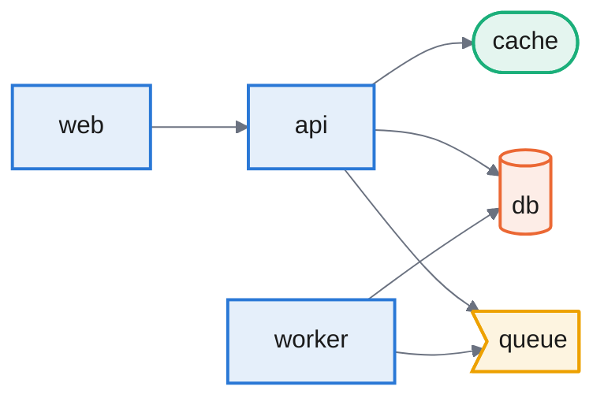

<!-- trazo-architecture -->
# Architecture

Generated by [Trazo](https://github.com/edgaragg/trazo) from this repository's infrastructure files. Do not edit by hand — regenerate it with `trazo generate examples/basic --format markdown --out ARCHITECTURE.md`.

## Components

- `api` (service)
- `cache` (cache, `redis:7`)
- `db` (database, `postgres:16`)
- `queue` (queue, `rabbitmq:3-management`)
- `web` (service)
- `worker` (service)

## Dependencies

- `api` → `cache`
- `api` → `db`
- `api` → `queue`
- `web` → `api`
- `worker` → `db`
- `worker` → `queue`
