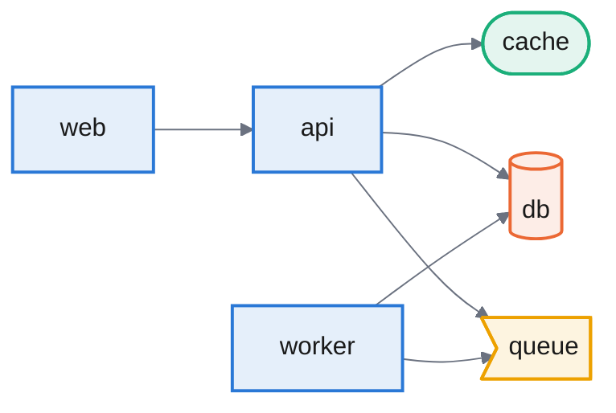

# trazo

Architecture docs that can't go stale. Trazo extracts your system's structure from code and infrastructure files, generates Mermaid diagrams, and flags architecture changes on every pull request.

> **Status: early.** It works end to end and reads Docker Compose, Kubernetes, CloudFormation / SAM and AWS Amplify. See the [roadmap](#roadmap).

## Why

Architecture diagrams rot. Someone draws one, the system changes, and a few weeks later the diagram is wrong and nobody trusts it.

Trazo takes a different approach: the diagram is never drawn by hand and never guessed. It is **generated from the files that already define your system**, and it is **re-checked on every pull request**, so a change to the architecture shows up in review instead of being discovered months later.

- **Deterministic.** Structure comes from parsing your files, not from a language model, so the diagram can't invent things that aren't there.
- **Lives in the PR.** Reviewers see which components and dependencies a change adds or removes, next to the code.
- **No server, no account.** It reads files in your repository. It runs locally, in any CI, or as a GitHub Action that needs no setup beyond a workflow file.

## Example

Given [`examples/basic/docker-compose.yml`](examples/basic/docker-compose.yml):

```bash
node packages/cli/dist/bin.js generate examples/basic
```



Databases, caches and queues are recognised from their image and drawn with their own shape and border colour (blue services, orange databases, teal caches, yellow queues) — a component added by a pull request is bordered green instead, taking priority over its kind's colour.

Trazo also reads Kubernetes manifests ([`examples/kubernetes/app.yaml`](examples/kubernetes/app.yaml)): Deployments, StatefulSets, DaemonSets, Jobs, CronJobs and Pods each become a component, and an Ingress is linked to the workload its backend Service selects.

It reads AWS too. [`examples/cloudformation/template.yaml`](examples/cloudformation/template.yaml) is a SAM application: tables, buckets, queues, topics, functions and APIs become components, and a component depends on whatever it refers to (`!Ref`, `!GetAtt`, `!Sub`, `DependsOn`), even through an IAM role. [`examples/cloudformation/web-tier.yaml`](examples/cloudformation/web-tier.yaml) is a classic servers-behind-a-load-balancer setup, where the VPC, subnets and security groups are left out. The arrow points from whoever calls to whoever is called, so an API points at the function behind it and a queue at the function it triggers. [`examples/amplify`](examples/amplify) is an Amplify (Gen 1) backend, read from its `backend-config.json`: each resource under its category, with its `dependsOn` as the dependencies.

## Installation

Trazo needs [Node.js](https://nodejs.org) 20 or later. It is published as two packages under the `@edgaragg` scope.

### Command line

Run it without installing anything:

```bash
npx @edgaragg/trazo-cli generate
```

Or install it globally. The command is called `trazo`, whatever the package is called:

```bash
npm install -g @edgaragg/trazo-cli
trazo --help
```

Or add it to a project, so everyone who works on it gets the same version:

```bash
npm install --save-dev @edgaragg/trazo-cli
npx trazo generate
```

### Library

To build your own tooling on the same model, install the engine on its own:

```bash
npm install @edgaragg/trazo-core
```

See the [package README](packages/core/README.md) for an example.

### In CI

Nothing to install by hand. On GitHub, add the [Action](#as-a-github-action); on Bitbucket, add the [Pipelines step](#as-a-bitbucket-pipelines-step), which runs `npx @edgaragg/trazo-cli bitbucket-comment`.

### Updating and removing

```bash
npm update -g @edgaragg/trazo-cli      # update a global install
npm uninstall -g @edgaragg/trazo-cli   # remove it
```

Trazo is at version 0.1, so the interface can still change between minor versions. In CI, pin the version you tested with (`npx @edgaragg/trazo-cli@0.2.0 ...`) instead of following whatever is newest.

## Usage

### As a GitHub Action

Add a workflow. It comments on pull requests that change the architecture, and updates that same comment on every push:

```yaml
name: Architecture
on: pull_request

permissions:
  contents: read
  pull-requests: write

jobs:
  trazo:
    runs-on: ubuntu-latest
    steps:
      - uses: actions/checkout@v7
        with:
          fetch-depth: 0 # Trazo compares against the base branch, so it needs history.
      - uses: edgaragg/trazo@main
```

Pull requests that don't touch the architecture stay quiet: no comment is posted.

### As a Bitbucket Pipelines step

Add a pull-request pipeline. It behaves exactly like the GitHub Action: quiet when nothing changed, one comment kept up to date otherwise.

```yaml
pipelines:
  pull-requests:
    '**':
      - step:
          name: Architecture
          image: node:22
          clone:
            depth: full # Trazo compares against the destination revision, so it needs history.
          script:
            - npx @edgaragg/trazo-cli bitbucket-comment
```

Unlike GitHub Actions, Bitbucket doesn't hand a pipeline a token that can write to pull requests, so add one yourself: a [Repository Access Token](https://support.atlassian.com/bitbucket-cloud/docs/repository-access-tokens/) with the `pullrequest:write` permission, saved as a secured repository variable named `TRAZO_BITBUCKET_TOKEN` (Repository settings → Pipelines → Repository variables).

### As a command line tool

See [Installation](#installation) for how to get the `trazo` command.

```bash
trazo generate [dir]                                   # print the architecture as a Mermaid diagram
trazo generate --format json                           # ...or as JSON
trazo generate --format markdown --out ARCHITECTURE.md # ...or a full doc, written to a file
trazo generate --write                                 # ...or written to .trazo/architecture.md (see Configuration)
trazo diff --base main                                 # report what changed since a git revision
```

`trazo diff` reads the base revision straight from git, so it never touches your working tree.

### Keeping a live ARCHITECTURE.md

A file only stays trustworthy if nothing has to remember to update it. [`architecture-doc.yml`](.github/workflows/architecture-doc.yml) regenerates `ARCHITECTURE.md` on every push to `main` and commits it back when it changed — the same principle as the pull request comment, aimed at the repository itself instead of a review. Add it to your own repository, or copy the `trazo generate --format markdown --out ARCHITECTURE.md` step into an existing workflow.

## Configuration

Everything works without a config. To change how Trazo draws things, add a `trazo.config.yaml` (or `.yml`) to the directory you scan, or point to another with `--config <path>`. Every part is optional, and Trazo rejects an unknown key, shape, colour or extractor instead of ignoring it, so a typo can't quietly change your diagram.

```yaml
output:                      # used by `trazo generate --write`
  dir: .trazo                # relative to the project (default)
  file: architecture.md      # default

kinds:                       # how each kind of component is drawn
  database:
    stroke: "#c0392b"        # change only what you list on a built-in kind...
  storage:                   # ...or define your own kind
    shape: cylinder          # rectangle, rounded, stadium, subroutine, cylinder, circle, flag, rhombus, hexagon, parallelogram
    stroke: "#0f766e"
    fill: "#e6f4f1"          # keep it light: labels are drawn in near-black

extractors:                  # what each extractor's findings become
  cloudformation:            # key: resource type. `*` is a wildcard
    "AWS::S3::Bucket": storage
    "Custom::*": service     # a type Trazo doesn't know is drawn too
    "AWS::ApiGateway::*": ignore
  amplify:                   # key: service
    S3: storage
  docker-compose:            # key: image name, without registry or tag
    minio: storage
  kubernetes:                # key: workload kind (Deployment, CronJob, Ingress...) or image name
    CronJob: ignore
```

- The built-in kinds are `service`, `database`, `cache` and `queue`. A rule can name one of them, a kind defined under `kinds`, or `ignore`. A kind with no style is drawn as a grey rectangle.
- Keys match ignoring case; when several match, the most specific wins (`AWS::S3::Bucket` over `AWS::S3::*`). A rule beats the built-in classification.
- `ignore` leaves the component out, and the dependencies on it. In CloudFormation, references through an ignored resource still count, the way they do through an IAM role.
- Rules change how something is drawn, never what exists: they can't add a dependency Trazo did not find.
- `trazo diff`, the GitHub Action and the Bitbucket step read the config from the working tree and apply it to both sides of the comparison, so editing the config doesn't show up as an architecture change.

## How it works

The repository is a small monorepo:

| Package | What it is |
| --- | --- |
| [`@edgaragg/trazo-core`](packages/core) | The logic: extractors that read files into a model, model diffing, Mermaid and Markdown rendering. It never touches the filesystem, so it is easy to test and reuse. |
| [`@edgaragg/trazo-cli`](packages/cli) | The command line (`trazo`). Finds files, reads them from disk or from git, and calls core. It also holds the `bitbucket-comment` command, since Bitbucket Pipelines just runs a command and needs no packaging of its own. |
| [`@edgaragg/trazo-action`](packages/action) | The GitHub Action. A thin layer over the CLI that posts the comment. Private: GitHub runs it from this repository, so it ships as a committed bundle instead of an npm package. |

```
files → extractor → architecture model → diff against base → Markdown report + Mermaid diagram
```

## Roadmap

- [x] Docker Compose (`services`, `depends_on`, `links`)
- [x] Kubernetes manifests (Deployment/StatefulSet/DaemonSet/Job/CronJob/Pod, Ingress → Service → workload)
- [x] CloudFormation / SAM templates (JSON and YAML), and AWS Amplify Gen 1 backends via `amplify/backend/backend-config.json`
- [ ] Amplify GraphQL: the models in `schema.graphql` (each `@model` is a DynamoDB table) and the auth rules between them
- [ ] AWS CDK: read the synthesised `cdk.out` templates, and Amplify Gen 2 through them
- [ ] Show the Kubernetes resource kind (Deployment, StatefulSet...) as the component's type, the way CloudFormation resources already show theirs
- [ ] A richer ARCHITECTURE.md (components and dependencies are very bare today)
- [ ] `trazo check`, to fail a build when the architecture changed without an update to the docs
- [ ] Optional LLM-written descriptions on top of the extracted model (bring your own API key)
- [x] A [`trazo.config.yaml`](#configuration): where `trazo generate --write` puts the document, how each kind of component is drawn, and which kind each thing an extractor recognises becomes (or `ignore`, or a custom kind)
- [ ] One document per source (Compose, each Kubernetes namespace, CloudFormation...) under `output.dir`, instead of a single `architecture.md`
- [ ] A `.trazoignore` file (and/or a CLI `--exclude` flag) to skip specific paths, for files that are illustrative rather than real — a Kubernetes manifest kept purely as a documentation example, for instance. Not solved by guessing from a filename or folder convention like `*.example.yaml`: that always misclassifies someone's setup in one direction or the other. An explicit, deterministic list of paths to skip stays true to "the diagram can't invent things that aren't there" — it also does not invent what to leave out.

## Limitations

- Only **declared** relationships are detected (`depends_on`, `links`, or an Ingress's backend Service). A service that finds its database through an environment variable is not linked to it, and raw Kubernetes manifests have no way to declare that one workload calls another.
- Docker Compose component ids come from the service name; two Compose files that define the same service name are merged into one component. Kubernetes ids are scoped to their namespace (`namespace/name`, defaulting to `default`), so the same resource name in different namespaces stays separate — but both are still drawn with just their bare name, so two same-named components from different namespaces look identical on a diagram that shows more than one namespace at once.
- A Kubernetes Service only selects workloads, and an Ingress only resolves a Service, within its own namespace — matching real Kubernetes behaviour — and only when they are declared in the *same file*; Trazo reads one file at a time, so a Service defined elsewhere can't be resolved.
- CloudFormation: a component depends on what it refers to inside the same template. Other stacks (`AWS::CloudFormation::Stack`), `Fn::ImportValue` and values passed as parameters are not followed, and neither is a resource name built by hand into a string. Only resource types that are components are drawn — functions, APIs, tables, buckets, queues, topics, caches and similar; an S3 bucket is drawn as a database, and there is no shape for storage. A reference through a shared IAM role or policy reaches everything that role can use, which is what the function can do rather than what it does.
- SAM: a function's `Api` or `HttpApi` event that names no API gets the `ServerlessRestApi` / `ServerlessHttpApi` SAM creates for it. `Globals` are not applied. An API whose `DefinitionBody` is an `AWS::Include` of an external OpenAPI file is not resolved, since its integrations live in that file, and the EventBridge rules SAM creates for `CloudWatchEvent` / `EventBridgeRule` events are not drawn.
- Amplify: only Gen 1 is read, from `backend-config.json`. The CloudFormation Amplify generates under `amplify/backend` is skipped on purpose (every function's template names its resource `LambdaFunction`), which also means what a resource does beyond its `dependsOn` is not visible. Gen 2 defines its backend in TypeScript and is not supported yet.
- The config is read from the scanned directory only, not merged from parent directories. `trazo generate --write` produces a single document; a document per source is on the roadmap.
- Directories that only hold build output or a copy of what is deployed are skipped while scanning: `node_modules`, `dist`, `build`, `.aws-sam`, `cdk.out` and Amplify's `#current-cloud-backend`. Naming one as the directory to scan still works. Files over 2 MB are skipped too, since every JSON and YAML file is offered to the CloudFormation reader.
- The Action can't comment on pull requests from forks, because GitHub gives those runs a read-only token. Bitbucket Pipelines has the same kind of gap from the other direction: by default it doesn't run a pull-request pipeline at all for a pull request opened from a fork, so `trazo bitbucket-comment` never runs on those either.

## Development

```bash
npm install         # also installs the pre-commit hook
npm run build       # compiles core, then the CLI, then bundles the Action
npm run typecheck
npm test
npm run trazo -- generate examples/basic   # run the CLI from source
```

Requires Node.js 20 or later.

### Adding a format

A format is an `Extractor`: a `matches(path)` check and an `extract(file)` function that returns components and dependencies. Add one in [`packages/core/src/extractors`](packages/core/src/extractors), register it in `defaultExtractors`, and cover it with a test. Nothing else needs to change.

The Action ships as a committed bundle (`packages/action/dist`), because GitHub runs actions straight from the repository. You don't rebuild it by hand: a pre-commit hook does it whenever a staged file can change the bundle, and CI fails if the committed bundle is out of date. The hook is installed by `npm install`; if you skip it (`--no-verify`), run `npm run build` yourself.

This repository also runs Trazo on its own pull requests ([`architecture.yml`](.github/workflows/architecture.yml)), using the bundle from the pull request itself.

## License

[MIT](LICENSE)
