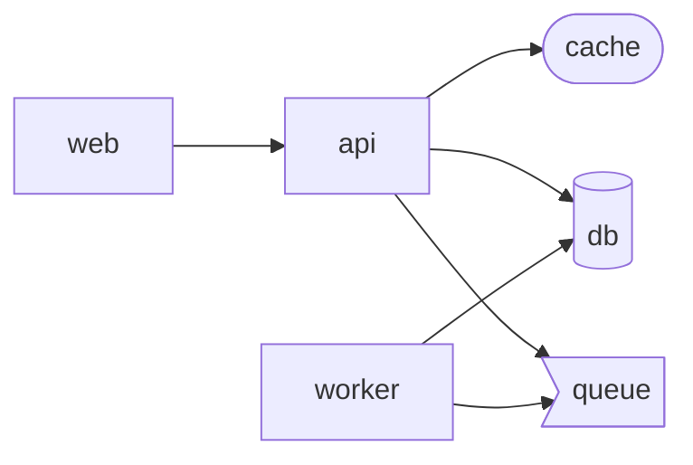

# trazo

Architecture docs that can't go stale. Trazo extracts your system's structure from code and infrastructure files, generates Mermaid diagrams, and flags architecture changes on every pull request.

> **Status: early.** It works end to end and reads Docker Compose and Kubernetes manifests. See the [roadmap](#roadmap).

## Why

Architecture diagrams rot. Someone draws one, the system changes, and a few weeks later the diagram is wrong and nobody trusts it.

Trazo takes a different approach: the diagram is never drawn by hand and never guessed. It is **generated from the files that already define your system**, and it is **re-checked on every pull request**, so a change to the architecture shows up in review instead of being discovered months later.

- **Deterministic.** Structure comes from parsing your files, not from a language model, so the diagram can't invent things that aren't there.
- **Lives in the PR.** Reviewers see which components and dependencies a change adds or removes, next to the code.
- **No server, no account.** It reads files in your repository. It runs locally, in any CI, or as a GitHub Action that needs no setup beyond a workflow file.

## Example

Given [`examples/basic/docker-compose.yml`](examples/basic/docker-compose.yml):

```bash
node packages/cli/dist/bin.js generate examples/basic
```



Databases, caches and queues are recognised from their image and drawn with their own shape.

Trazo also reads Kubernetes manifests ([`examples/kubernetes/app.yaml`](examples/kubernetes/app.yaml)): Deployments, StatefulSets, DaemonSets, Jobs, CronJobs and Pods each become a component, and an Ingress is linked to the workload its backend Service selects.

## Usage

### As a GitHub Action

Add a workflow. It comments on pull requests that change the architecture, and updates that same comment on every push:

```yaml
name: Architecture
on: pull_request

permissions:
  contents: read
  pull-requests: write

jobs:
  trazo:
    runs-on: ubuntu-latest
    steps:
      - uses: actions/checkout@v4
        with:
          fetch-depth: 0 # Trazo compares against the base branch, so it needs history.
      - uses: edgaragg/trazo@main
```

Pull requests that don't touch the architecture stay quiet: no comment is posted.

### As a command line tool

```bash
trazo generate [dir]                                   # print the architecture as a Mermaid diagram
trazo generate --format json                           # ...or as JSON
trazo generate --format markdown --out ARCHITECTURE.md # ...or a full doc, written to a file
trazo diff --base main                                 # report what changed since a git revision
```

`trazo diff` reads the base revision straight from git, so it never touches your working tree.

### Keeping a live ARCHITECTURE.md

A file only stays trustworthy if nothing has to remember to update it. [`architecture-doc.yml`](.github/workflows/architecture-doc.yml) regenerates `ARCHITECTURE.md` on every push to `main` and commits it back when it changed — the same principle as the pull request comment, aimed at the repository itself instead of a review. Add it to your own repository, or copy the `trazo generate --format markdown --out ARCHITECTURE.md` step into an existing workflow.

## How it works

The repository is a small monorepo:

| Package | What it is |
| --- | --- |
| [`@trazo/core`](packages/core) | The logic: extractors that read files into a model, model diffing, Mermaid and Markdown rendering. It never touches the filesystem, so it is easy to test and reuse. |
| [`trazo`](packages/cli) | The command line. Finds files, reads them from disk or from git, and calls core. |
| [`@trazo/action`](packages/action) | The GitHub Action. A thin layer over the CLI that posts the comment. |

```
files → extractor → architecture model → diff against base → Markdown report + Mermaid diagram
```

## Roadmap

- [x] Docker Compose (`services`, `depends_on`, `links`)
- [x] Kubernetes manifests (Deployment/StatefulSet/DaemonSet/Job/CronJob/Pod, Ingress → Service → workload)
- [ ] CloudFormation / SAM templates
- [ ] `trazo check`, to fail a build when the architecture changed without an update to the docs
- [ ] Optional LLM-written descriptions on top of the extracted model (bring your own API key)

## Limitations

- Only **declared** relationships are detected (`depends_on`, `links`, or an Ingress's backend Service). A service that finds its database through an environment variable is not linked to it, and raw Kubernetes manifests have no way to declare that one workload calls another.
- Component ids come from service or resource names. Two files that define the same name are merged into one component.
- A Kubernetes Ingress is only linked to a workload when the Service between them is declared in the *same file*; Trazo reads one file at a time, so a Service defined elsewhere can't be resolved.
- The Action can't comment on pull requests from forks, because GitHub gives those runs a read-only token.

## Development

```bash
npm install         # also installs the pre-commit hook
npm run build       # compiles core, then the CLI, then bundles the Action
npm run typecheck
npm test
npm run trazo -- generate examples/basic   # run the CLI from source
```

Requires Node.js 20 or later.

### Adding a format

A format is an `Extractor`: a `matches(path)` check and an `extract(file)` function that returns components and dependencies. Add one in [`packages/core/src/extractors`](packages/core/src/extractors), register it in `defaultExtractors`, and cover it with a test. Nothing else needs to change.

The Action ships as a committed bundle (`packages/action/dist`), because GitHub runs actions straight from the repository. You don't rebuild it by hand: a pre-commit hook does it whenever a staged file can change the bundle, and CI fails if the committed bundle is out of date. The hook is installed by `npm install`; if you skip it (`--no-verify`), run `npm run build` yourself.

This repository also runs Trazo on its own pull requests ([`architecture.yml`](.github/workflows/architecture.yml)), using the bundle from the pull request itself.

## License

[MIT](LICENSE)
